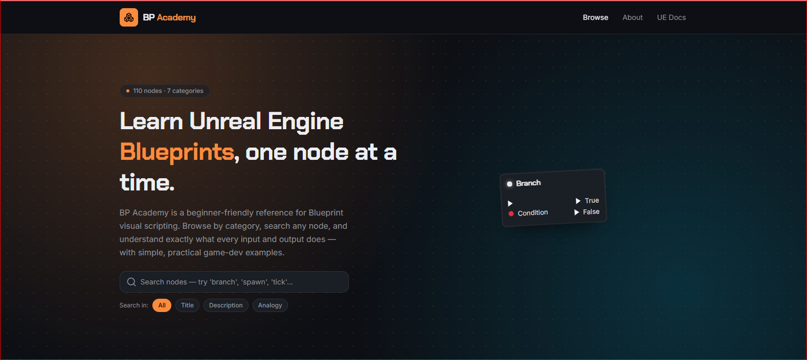

# BP Academy

BP Academy is an Unreal Engine Blueprint learning platform created by Utkarsh.

## Features 

- 153+ Blueprint Nodes
- Beginner-Friendly Explanations
- Real World Examples
- Structured Learning Path

## Coming Soon

-500+ Blueprint Node
-learning system for niagara 

## Website

https://bpacademy.lovable.app

## Goal

Help beginners learn Unreal Engine Blueprints in a simple and practical way.
## Screenshot

